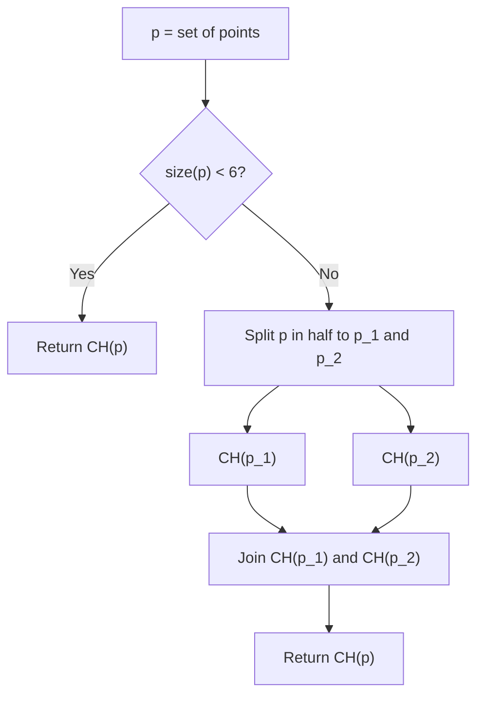

# Convex Hull Algorithms

This module contains different algorithms for convex hull creation from a given point set.

- [ ] Incremental Construction
- [ ] Direct hull from 3 or 4 points
- [ ] Brute force
- [ ] Graham Scan
- [ ] Divide and Conquer

## Incremental Construction

<!-- snippet: AddPoint -->
```cs
var convexHull = ConvexHull.ConvexHull4(a, b, c, d);
convexHull.Add(new Point2(5, 5));
```
<!-- endSnippet -->

## Directly Creating Small Convex Hulls

These are special cases of brute force approach to very small point sets. The convex hull of four points can be created using a specific method:

<!-- snippet: ConvexHull4 -->
```cs
var a = new Point2(0, 0);
var c = new Point2(1, 0);
var b = new Point2(1, 1);
var d = new Point2(0, 1);

var convexHull4 = ConvexHull.ConvexHull4(a, b, c, d);
```
<!-- endSnippet -->

Or for a general case of sets of up to five points (inclusive) a more generic method can be used:

<!-- snippet: SimpleConvexHull -->
```cs
var pts = new List<Point2>()
{
    new(0, 0),
    new(0, 1),
    new(1, 0)
};

var ch = ConvexHull.CreateSimpleHull(pts);
```
<!-- endSnippet -->

In the case of five points, this general method uses the brute-force approach.

## Brute Force

It possible to create convex hulls using the brute force algorithms on arbitrary large sets of points using the following static method:
 
<!-- snippet: BruteForceConvexHull -->
```cs
var a = new Point2(0, 0);
var c = new Point2(2, 0);
var b = new Point2(2, 3);
var d = new Point2(1, 3);
var e = new Point2(0, 2);

var ch = ConvexHull.BruteForce(new[] { a, b, c, d, e });
```
<!-- endSnippet -->

The computational complexity of this algorithm is _O(n<sup>3</sup>)_.

## Graham Scan

Graham Scan works in two steps - first the points are sorted and then scanned.

When sorting the points, first an extreme point _p<sub>0</sub>_ is found that is sure to be positioned on the convex hull, in our case, that is the leftmost point with minimum y-coordinate. The other points in the set are then sorted according to the counterclockwise angle between positive x-axis and the the line defined by _p<sub>0</sub>_ and the point being sorted _p<sub>i</sub>_.

Scanning step then traverses all of the points and only adds those points which create counterclockwise-oriented new edges on the convex hull.

<!-- snippet: GrahamScanConvexHull -->
```cs
var a = new Point2(0, 0);
var b = new Point2(1, 0);
var c = new Point2(1, 1);
var d = new Point2(0, 1);

var ch = ConvexHull.GrahamScan(new[] { a, b, c, d });
```
<!-- endSnippet -->

## Divide and Conquer



The divide and conquer algorithm creates convex hulls of 3-4 point subsets directly and uses the brute force approach for 5 point subsets. The _Join_ step is performed using Graham Scan.
