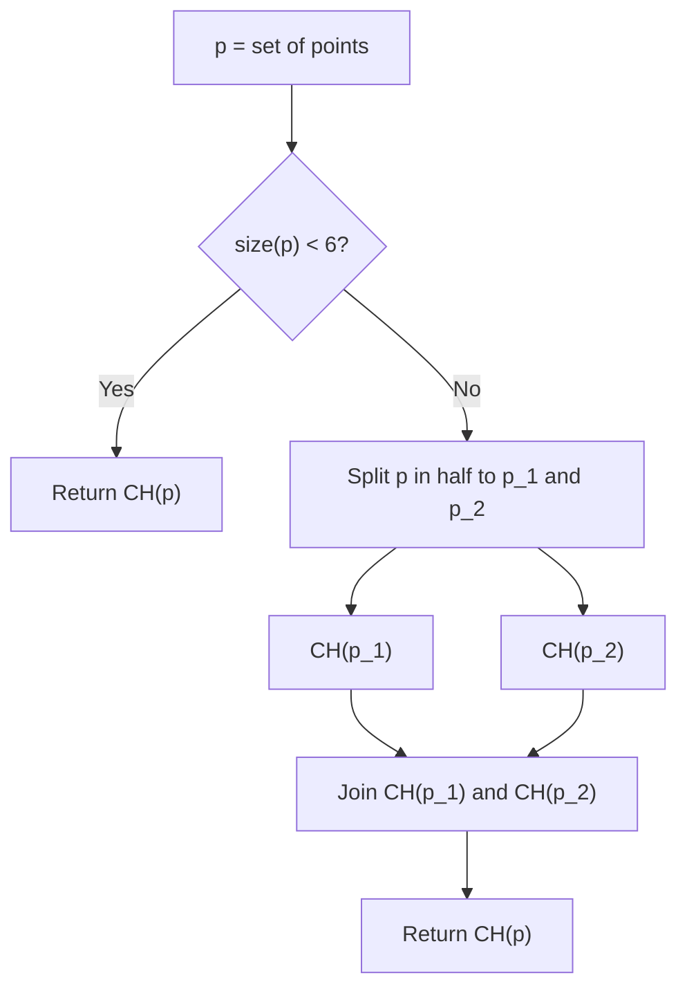

# Convex Hull Algorithms

This module contains different algorithms for convex hull creation from a given point set.

- [ ] Direct hull from 3 or 4 points
- [ ] Brute force
- [ ] Graham Scan
- [ ] Divide and Conquer

## Divide and Conquer



The divide and conquer algorithm uses a brute force approach to construct the convex hulls of 5 point subsets. It is however possible to use this brute force approach for larger sets of points directly if desired.


<!-- snippet: BruteForceConvexHull -->
```cs
var a = new Point2(0, 0);
var c = new Point2(2, 0);
var b = new Point2(2, 3);
var d = new Point2(1, 3);
var e = new Point2(0, 2);

var ch = ConvexHull.BruteForce(new[] { a, b, c, d, e });
```
<!-- endSnippet -->
