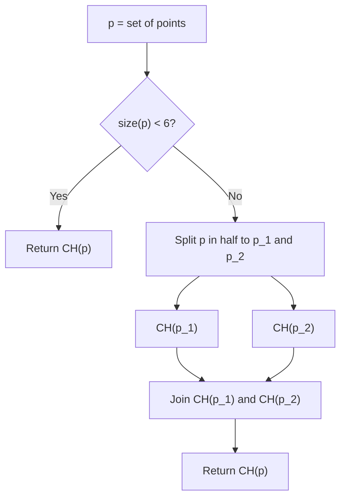

# Convex Hull Algorithms

This module contains different algorithms for convex hull creation from a given point set.

- [ ] Direct hull from 3 or 4 points
- [ ] Brute force
- [ ] Graham Scan
- [ ] Divide and Conquer

## Directly Creating Small Convex Hulls

These are special cases of brute force approach to very small point sets.

<!-- missingSnippet: ConvexHull3and4 -->
<!-- endmissingSnippet -->

## Brute Force

 It possible to create convex hulls using the brute force algorithms on arbitrary large sets of points using the following static method:
 
<!-- snippet: BruteForceConvexHull -->
```cs
var a = new Point2(0, 0);
var c = new Point2(2, 0);
var b = new Point2(2, 3);
var d = new Point2(1, 3);
var e = new Point2(0, 2);

var ch = ConvexHull.BruteForce(new[] { a, b, c, d, e });
```
<!-- endSnippet -->

Note that the computational complexity of this algorithm is _O(n<sup>3</sup>)_.

## Graham Scan
<!-- snippet: GrahamScanConvexHull -->
```cs
var a = new Point2(0, 0);
var b = new Point2(1, 0);
var c = new Point2(1, 1);
var d = new Point2(0, 1);

var ch = ConvexHull.GrahamScan(new[] { a, b, c, d });
```
<!-- endSnippet -->

## Divide and Conquer



The divide and conquer algorithm creates convex hulls of 3-4 point subsets directly and uses the brute force approach for 5 point subsets. The _Join_ step is performed using Graham Scan.
