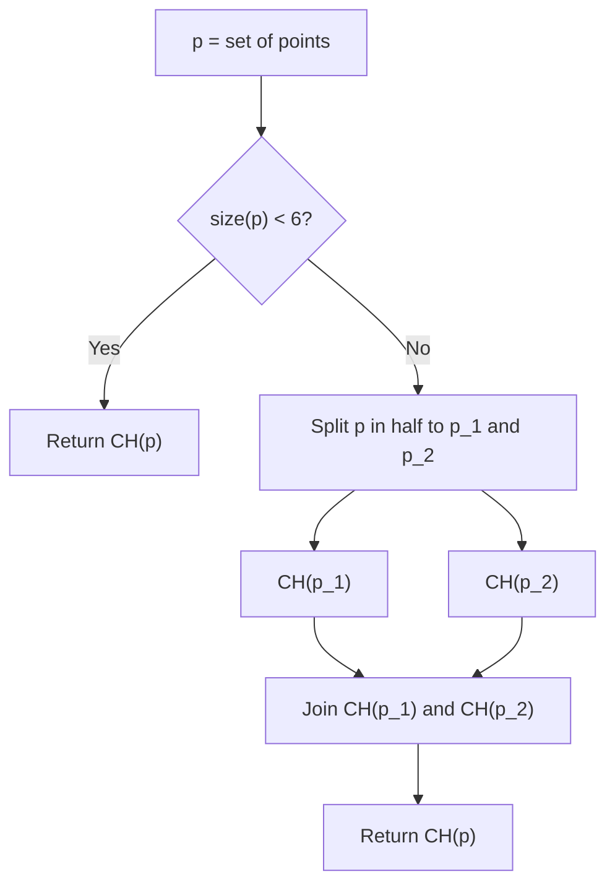

<!--
GENERATED FILE - DO NOT EDIT
This file was generated by [MarkdownSnippets](https://github.com/SimonCropp/MarkdownSnippets).
Source File: /README.source.md
To change this file edit the source file and then run MarkdownSnippets.
-->

# Geometrica: A Library for Various Geometry-Related Tasks

[](https://github.com/tvomacka/Geometrica/actions/workflows/on-push-do-docs.yml)

## Point Operations

You can check the orientation of three points using an orientation test:

<!-- snippet: OrientationTest -->
```cs
var p = new Point2(0, 0);
var q = new Point2(0, 1);
var r = new Point2(1, 0);

Assert.IsTrue(Point2.Orientation(p, q, r) < 0);
```
<!-- endSnippet -->

or

<!-- snippet: CCWOrientationTest -->
```cs
var p = new Point2(0, 0);
var q = new Point2(1, 0);
var r = new Point2(0, 1);

Assert.IsTrue(Point2.OrientedCCW(p, q, r));
```
<!-- endSnippet -->

## Convex Hull

This module contains different algorithms for convex hull creation from a given point set.

- [ ] Direct hull from 3 or 4 points
- [ ] Brute force
- [ ] Graham Scan
- [ ] Divide and Conquer

<!-- snippet: CreateConvexHull -->
```cs
var pts = new List<Point2>() 
{
    new(0, 0),
    new(1, 0),
    new(0, 1),
    new(0.1, 0.1)
};

var ch = new ConvexHull(pts);
```
<!-- endSnippet -->

Uses a divide and conquer algorightm to create convex hulls by default.



The divide and conquer algorithm uses a brute force approach to construct the convex hulls of 5 point subsets. It is however possible to use this brute force approach for larger sets of points directly if desired.


<!-- snippet: BruteForceConvexHull -->
```cs
var a = new Point2(0, 0);
var c = new Point2(2, 0);
var b = new Point2(2, 3);
var d = new Point2(1, 3);
var e = new Point2(0, 2);

var ch = ConvexHull.BruteForce(new[] { a, b, c, d, e });
```
<!-- endSnippet -->
