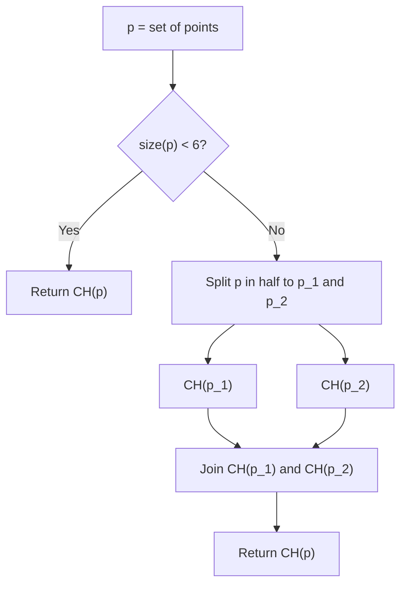

# Geometrica: A Library for Various Geometry-Related Tasks

## Point Operations

You can check the orientation of three points using an orientation test:

snippet: OrientationTest

or

snippet: CCWOrientationTest

## Convex Hull

This module contains different algorithms for convex hull creation from a given point set.

- [ ] Direct hull from 3 or 4 points
- [ ] Brute force
- [ ] Graham Scan
- [ ] Divide and Conquer

snippet: CreateConvexHull

Uses a divide and conquer algorightm to create convex hulls by default.

The divide and conquer algorithm uses a brute force approach to construct the convex hulls of 5 point subsets. It is however possible to use this brute force approach for larger sets of points directly if desired.

snippet: BruteForceConvexHull
