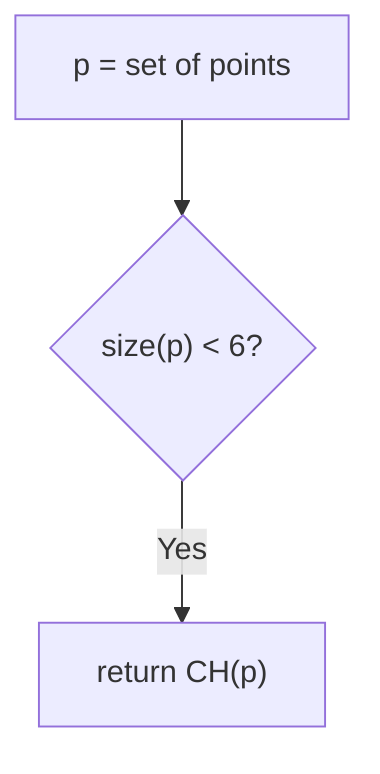

# Library for Various Geometry-Related Tasks

## Point Operations

You can check the orientation of three points using an orientation test:

snippet: OrientationTest

or

snippet: CCWOrientationTest

## Convex Hull

snippet: CreateConvexHull

Uses a divide and conquer algorightm to create convex hulls by default.

The divide and conquer algorithm uses a brute force approach to construct the convex hulls of 5 point subsets. It is however possible to use this brute force approach for larger sets of points directly if desired.

snippet: BruteForceConvexHull
